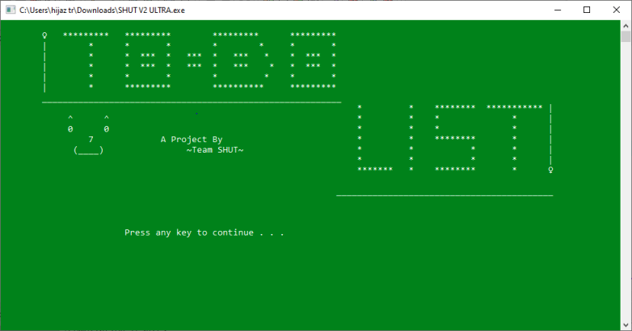
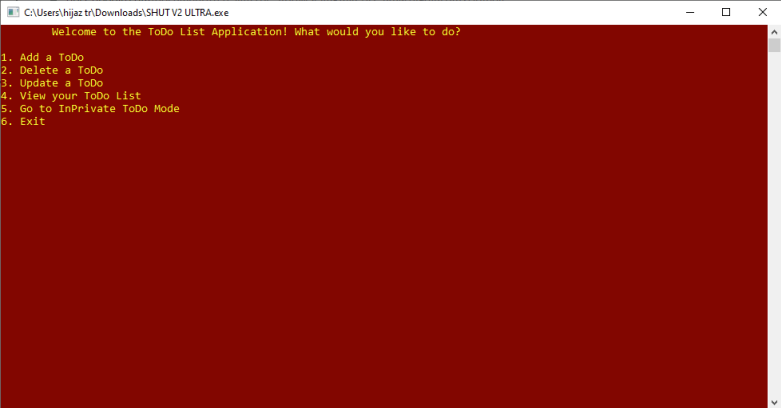
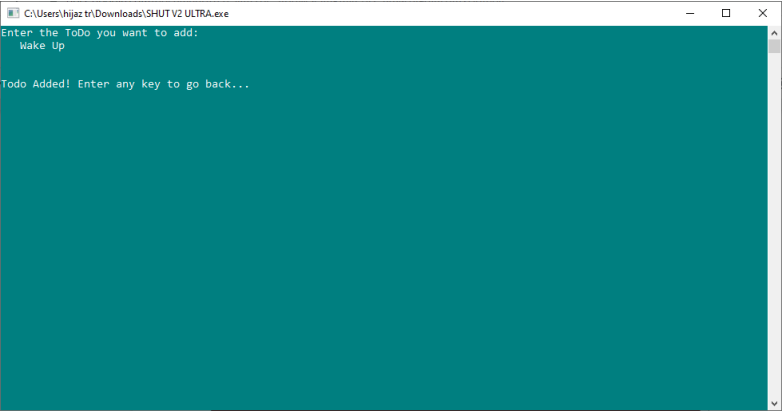
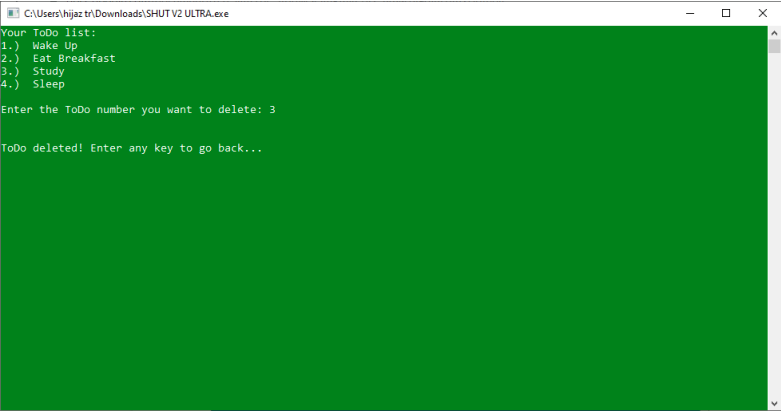
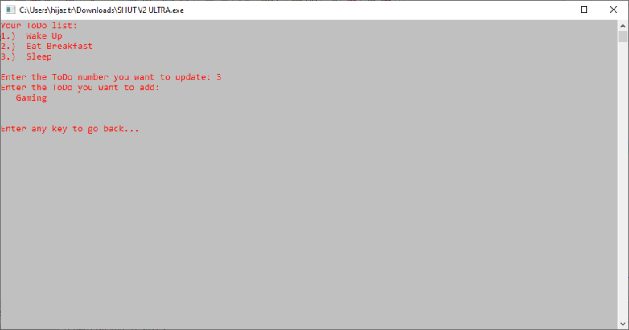
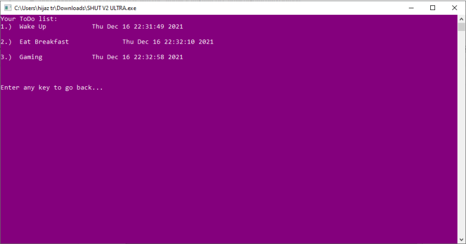
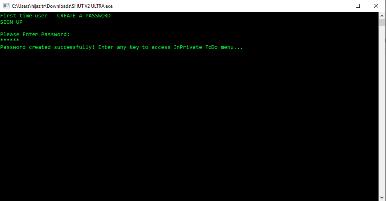
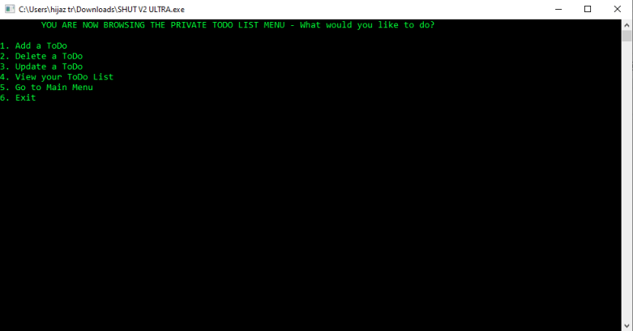
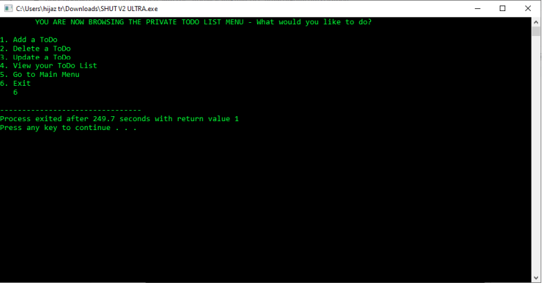

# To-Do List Application

#### Introduction:
Created a To-Do list application that performs CRUD (Create, Read, Update, Delete) using a simple interface for my university's Programming Fundamentals semester project.

#### Project Specification:
Users can create private, password-protected To-Dos separate from the globally available main To-Dos.

#### Solution Design:
- Each item in the To-Do list is part of an array of structures.
- Each structure contains a character string str that contains the To-Do text, time_str that stores the current time automatically during to-do entry, and an integer count that tracks the serial number of the to-do item.
- The main menu consists of 6 options:
    1. Add a ToDo
    2. Delete a ToDo
    3. Update a ToDo
    4. View the list
    5. Go to InPrivate Todos (password protected to-dos)
    6. Exit
- All six options make use of switch cases to call their respective functions.
- Global variables count_main and count_priv keep track of the index of public and private todos.
- Function addToDo takes a pointer count argument to take an input and uses strcpy to add it to the todo array.
- Function deleteToDo takes a pointer count argument, inputs the integer to compare against the count, and deletes the todo if the integer is equal to the count of the todo item.
- Function updateToDo takes a pointer count argument, inputs the integer to compare against the count, and updates the todo if the integer is equal to the count of the todo item.
- Function viewToDo lists all the todos using a for loop.
- Function inPrivate prompts the user to sign up for the first time by creating a password, then asks for the password as login. It has the same functionality as the main function, but the access to inPrivate is password protected, for the user’s privacy
## Screenshots

## Acknowledgements

 - Saad Salman (group member)
 - Umer Nasir (group member)
 - Taha Ismail (group member)
 - [Sushant Gaurav](https://www.geeksforgeeks.org/todo-app-in-c-language/)